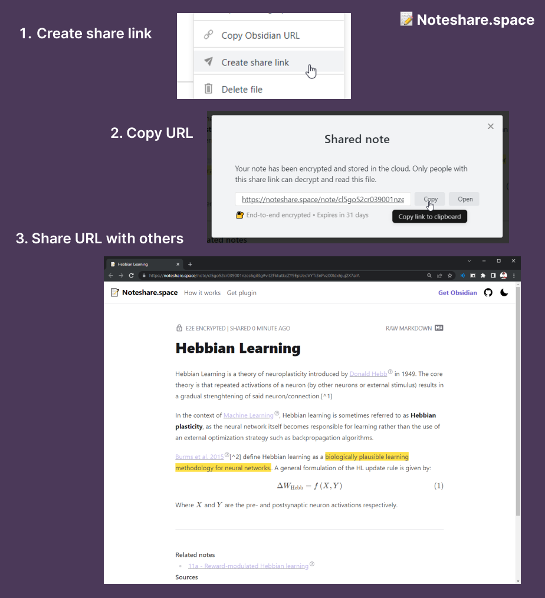

 

# Obsidian Note Sharing - Securely share your Obsidian notes with one click

Host Obsidian notes over the internet using end-to-end encryption.

## Functionality

- Secure note storage using AES-256-CBC encryption
- Requires no account or external API keys
- Option to host your own storage instance

## How it works

Your notes are stored securely using strong AES-256-CBC encryption. The decryption key is never sent to the server, so not even the server can open your notes.

By default, notes are stored on my companion project, [Noteshare.space](https://noteshare.space/). It is a simple storage service that caches your encrypted notes for 31 days and hosts a web application for viewing them. Both the server and frontend are [open source](https://github.com/mcndt/noteshare.space) under the MIT license. Users are free to host an instance of the storage service at their own domain.